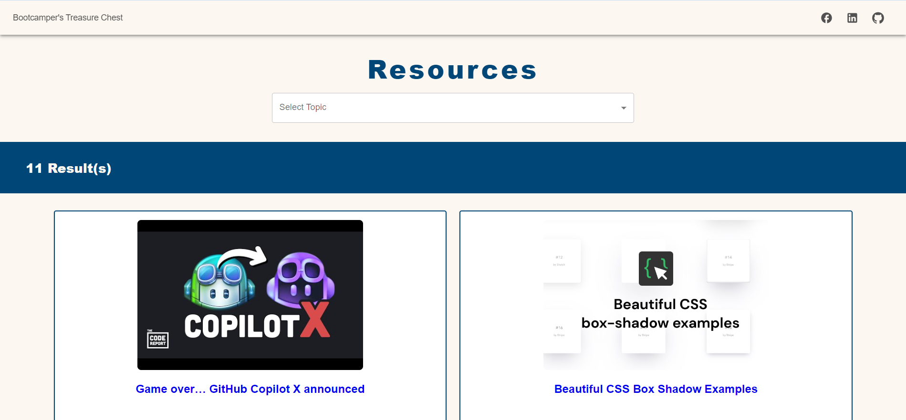

# Bootcampers' Treasure chest

In Week 7 of my School of Code journey, I got to work on a team frontend project, addressing a common challenge faced by School of Code bootcampers.

### The challenge:
Bootcampers often found it challenging to access and categorize the plethora of learning and tech resources available to them.

### Our solution:
An app that streamlines these resources, categorizing them for easy access. We chose React to ensure code maintainability and reusability, while delving into MaterialUI to enhance the user experience and learn the application of a new library. Importantly, we prioritized web accessibility standards to ensure inclusivity.


## Website Link

You can visit the deployed website here:

[Deployed Website Link](https://anastasiaadamoudi.github.io/BootcampersTreasureChest/)


## Screenshots




## Installation

This project was bootstrapped with [Create React App](https://github.com/facebook/create-react-app).

Install my-project with npm:

```bash
  npm install my-project
  cd my-project
```


    
## Run Locally

Clone the project:

```bash
  git clone https://github.com/AnastasiaAdamoudi/BootcampersTreasureChest
```

Go to the project directory:

```bash
  cd my-project
```

Install dependencies:

```bash
  npm install
```

Start the server:

```bash
  npm run start
```

Open [http://localhost:3000](http://localhost:3000) to view it in your browser.


## Deployment

To deploy this project on GitHub pages, run:

```bash
  npm run deploy
```


## Tech Stack

**Design:** Figma

**Collaboration:** Git

**Development:** React.js, CSS, MaterialUI


## Contributors

- [@alicefirminger](https://github.com/alicefirminger)
- [@SBaldwin](https://github.com/SBaldwin-Git)
- Abdi


